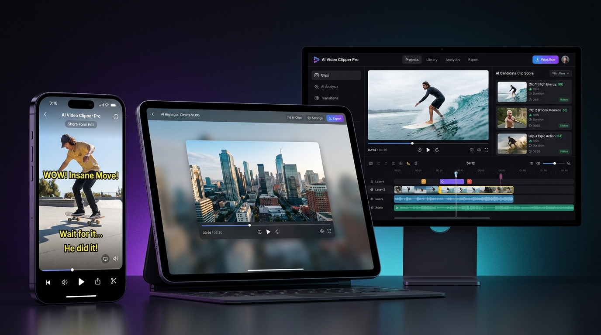

# AI Video Clipper Pro

Production-grade AI video clipping and short-form discovery platform that converts long-form videos into high-retention 9:16 vertical clips optimized for TikTok, Instagram Reels, and YouTube Shorts.

---

## Architectural Overview

AI Video Clipper Pro is structured as a decoupled full-stack application designed for deterministic media processing, resilient AI reasoning, and high-performance video rendering.

### Core Technology Stack

- **Frontend**: Next.js 15 (App Router), TypeScript, Tailwind CSS, shadcn/ui, Radix UI Primitives, Lucide Icons
- **Backend**: Python 3.11+, FastAPI, SQLAlchemy Async, SQLite / PostgreSQL, Pydantic V2
- **Speech Recognition**: Deepgram Nova-3 API (Word-level timestamps, speaker diarization) with local Faster-Whisper fallback
- **Reasoning Engine**: Groq LPU (Llama 3), Google Gemini 2.0 Flash (Multimodal reasoning), and deterministic heuristic fallback
- **Media Processing**: FFmpeg 7+ / 9.0 Pro, OpenCV, PySceneDetect

---

## Multi-Device & Canvas Format Support

AI Video Clipper Pro provides native, responsive multi-format rendering across Mobile, Tablet, and Desktop screens.



### Supported Canvas Formats

| Format Mode | Aspect Ratio | Target Resolution | Primary Use Case | Output Characteristics |
|:---|:---|:---|:---|:---|
| **Mobile Short-Form** | 9:16 Vertical | 1080 x 1920 | TikTok, Reels, Shorts | Full vertical crop, face/subject focal tracking, animated karaoke captions. |
| **Tablet / Frosted Blur** | 16:9 in 9:16 | 1080 x 1920 | Podcasts, Interviews | 100% widescreen fit centered over a dynamic Gaussian-blurred video canvas. |
| **Desktop / Widescreen** | 16:9 Native | 1920 x 1080 | YouTube, Twitter/X | Preserves source resolution without vertical crop or frame distortion. |

#### 1. Mobile (9:16 Full Vertical)
- **Target Platforms**: TikTok, Instagram Reels, YouTube Shorts
- **Framing Engine**: Dynamic subject tracking centers speakers and crops horizontal excess.
- **Safe-Zones**: Subtitles and visual hooks avoid bottom tab bars and right-side interactive engagement buttons (Like, Comment, Share).

#### 2. iPad & Tablet (16:9 in 9:16 Blurred Canvas)
- **Target Use Cases**: Multi-speaker podcasts, software demonstrations, widescreen interviews.
- **Frosted Blur Engine**: Renders uncropped 16:9 video centered with a background Gaussian blur layer (customizable from 5px to 60px) and a 35% luminosity dim.

#### 3. Web & Desktop (16:9 Native Landscape)
- **Target Use Cases**: Standard desktop browsers, YouTube long-form, Twitter/X feeds.
- **Zero Transformation**: Direct high-bitrate clipping with burned-in subtitles positioned within the lower-third.

---

## Deterministic 21-Stage Video Pipeline

Every uploaded video is processed through a sequential, state-tracked pipeline with real-time WebSocket and polling observability:

1. **Validate File**: MIME type verification, container integrity, and duration inspection.
2. **Inspect Media Metadata**: Audio sample rates, video dimensions, frame rates, and codec compliance via FFprobe.
3. **Create Job**: Initialization of persistent SQLite job record with user-configured presets.
4. **Extract Audio**: High-efficiency extraction of 16kHz mono PCM WAV audio for acoustic modeling.
5. **Transcribe Audio**: Deepgram Cloud STT / Faster-Whisper transcription preserving word-level timestamps.
6. **Detect Scenes**: Audio silence analysis, dead-air boundary detection, and scene transitions.
7. **Generate Timestamped Transcript**: Alignment and serialization of timed speech segments.
8. **Detect Candidate Moments**: Autonomous discovery of candidate clips using structured JSON schema validation.
9. **Expand Candidate Context**: Natural boundary expansion to complete preceding thoughts and resolve payoffs.
10. **Analyze Candidate Quality**: Evaluation of linguistic tension, curiosity gaps, and narrative hooks.
11. **Score Candidates**: Computation of 12-factor composite metric (hook, retention, story, payoff, shareability).
12. **Remove Duplicates / Overlaps**: Temporal Intersection-over-Union (IoU) Non-Maximum Suppression (NMS).
13. **Rank Globally**: Normalization and global priority sorting across candidate pools.
14. **Apply User Duration Constraints**: Preservation of narrative arcs within target durations (15-30s, 30-45s, 45-60s, 60-90s).
15. **Generate Final Clip Boundaries**: Generation of exact trimming intervals with dead-air excision.
16. **Render Clips Using FFmpeg**: 9:16 vertical crop, 16:9 blurred background synthesis, or native 16:9 export.
17. **Generate Captions**: Generation of timed Advanced SubStation Alpha (.ass) and SubRip (.srt) subtitle tracks.
18. **Generate Thumbnails**: Extraction of high-engagement hook keyframes.
19. **Generate Clip Metadata**: Production of viral titles, captions, and platform hashtags.
20. **Store Results**: Persistence of clip assets, video streams, and scoring metrics to local database.
21. **Mark Job Complete**: Finalization of job state and emission of completion signals.

---

## AI Provider Resilience and Fallback Matrix

To guarantee uninterrupted processing regardless of rate limits or service outages, the system utilizes a chained multi-provider architecture:

```
+-------------------------------------------------------------------+
|                        Client Job Request                         |
+-------------------------------------------------------------------+
                                  |
                                  v
+-------------------------------------------------------------------+
|                  Stage 5: Speech-to-Text (STT)                    |
|    Deepgram Nova-3 Cloud STT ----(Fallback)----> Faster-Whisper   |
+-------------------------------------------------------------------+
                                  |
                                  v
+-------------------------------------------------------------------+
|               Stage 8: Candidate Moment Discovery                 |
|   Groq LPU (Llama 3) ----(401/429 Fallback)----> Gemini 2.0 Flash |
|                                |                                  |
|                      (All Providers Failed)                       |
|                                |                                  |
|                                v                                  |
|                 Deterministic Heuristic Fallback                  |
+-------------------------------------------------------------------+
                                  |
                                  v
+-------------------------------------------------------------------+
|                     Stage 16: Media Rendering                     |
|           FFmpeg Vertical Framing + Subtitle Burn-In              |
+-------------------------------------------------------------------+
```

- **Deepgram Nova-3**: Cloud speech recognition supporting word timestamps and speaker identification.
- **Groq LPU**: Sub-second candidate extraction running Llama 3 models.
- **Google Gemini 2.0 Flash**: Multi-modal fallback capable of contextual reasoning and visual validation.
- **Heuristic Engine**: Deterministic fallback guaranteeing pipeline completion under total network isolation.

---

## Project Structure

```
Clipper/
|-- backend/
|   |-- app/
|   |   |-- api/routes/          # REST endpoints (upload, jobs, clips, settings, admin)
|   |   |-- core/                # Database configuration, SQLite schema, SQLAlchemy models
|   |   |-- services/
|   |   |   |-- ai/              # Resilient AI engine (Groq, Gemini, Local Heuristics)
|   |   |   |-- audio/           # Speech-to-text (Deepgram Nova-3, Faster-Whisper)
|   |   |   |-- media/           # FFmpeg rendering, scene detection, subtitle burn-in
|   |   |   `-- pipeline/        # 21-stage deterministic orchestration & candidate scoring
|   |   `-- main.py              # FastAPI application entrypoint
|   `-- tests/                   # Pytest test suite
|-- frontend/
|   |-- public/                  # Static assets, brand logos, favicons, web manifest
|   |-- src/
|   |   |-- app/                 # Next.js 15 App Router pages & server routes
|   |   |-- components/
|   |   |   |-- ui/              # shadcn/ui components (buttons, badges, cards, sliders)
|   |   |   |-- upload/          # Single and batch video drag-and-drop wizards
|   |   |   |-- processing/      # 21-stage live progress monitor & log telemetry
|   |   |   `-- review/          # Clip workstation, timeline scrubber, player safe-zone
|   |   `-- lib/                 # Type definitions, API client, utility functions
|   `-- tailwind.config.ts       # shadcn/ui design tokens & zinc dark theme
`-- docs/assets/                 # Architecture diagrams and UI preview assets
```

---

## Installation and Setup

### Prerequisites
- Python 3.11 or newer
- Node.js 18 or newer
- FFmpeg 6.0+ (compiled with `libass` for subtitle burn-in)

### 1. Backend Setup

```bash
cd backend
python3 -m venv .venv
source .venv/bin/activate
pip install -e .
```

Start the FastAPI backend service:

```bash
uvicorn app.main:app --host 0.0.0.0 --port 8000 --reload
```

The API documentation is available at `http://localhost:8000/docs`.

### 2. Frontend Setup

```bash
cd frontend
npm install
npm run dev
```

The web application is accessible at `http://localhost:3000` (or `http://localhost:3001`).

---

## Environment Variables

| Variable | Type | Description | Default |
|:---|:---|:---|:---|
| `AI_PROVIDER` | string | Primary reasoning engine (`groq`, `gemini`, `mock`) | `groq` |
| `GROQ_API_KEY` | string | Groq Cloud API authentication key | Optional |
| `GROQ_MODEL` | string | Groq model identifier | `llama-3.3-70b-versatile` |
| `GEMINI_API_KEY` | string | Google Gemini AI authentication key | Optional |
| `GEMINI_MODEL` | string | Gemini model identifier | `gemini-2.0-flash` |
| `DEEPGRAM_API_KEY` | string | Deepgram Cloud STT API key | Optional |
| `DEEPGRAM_MODEL` | string | Deepgram acoustic model | `nova-3` |
| `TRANSCRIBER_PROVIDER` | string | Speech recognition backend (`auto`, `deepgram`, `whisper`) | `auto` |
| `WHISPER_MODEL_SIZE` | string | Local Faster-Whisper model size | `base` |
| `DATABASE_URL` | string | Database connection string | `sqlite+aiosqlite:///./data/clipper.db` |
| `DATA_DIR` | string | Storage directory for video artifacts | `./data` |

---

## Live Deployments

- **Production Frontend**: [https://ai-clipper-pro.vercel.app](https://ai-clipper-pro.vercel.app)
- **Secondary Domain**: [https://clipper-ai-pro.vercel.app](https://clipper-ai-pro.vercel.app)
- **Source Code**: [https://github.com/Sange-creator/Clipper](https://github.com/Sange-creator/Clipper)

---

## License

This project is licensed under the Apache License 2.0.
