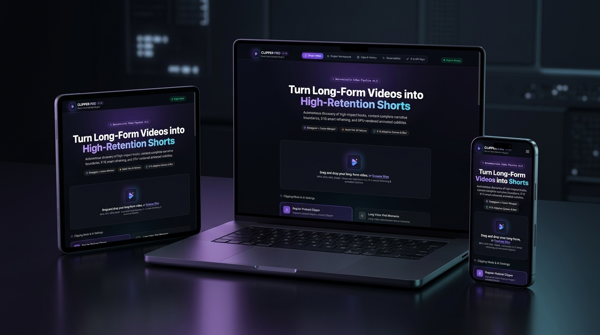

# AI Video Clipper Pro

Production-grade AI video clipping and viral content discovery platform that automatically discovers, ranks, slices, and renders high-retention short-form clips for TikTok, Instagram Reels, and YouTube Shorts.

---



---

## 🌐 Live Web Application & System Architecture

### Frontend Live on Vercel
The frontend is already built, optimized, and deployed live to production on Vercel:
👉 **[https://ai-clipper-pro.vercel.app/](https://ai-clipper-pro.vercel.app/)**

### Why the Backend Runs on Your Local Machine or VPS
Heavy media operations—**FFmpeg vertical 9:16 reframing, OpenCV watermark detection/erasing, acoustic audio analysis, and faster-whisper/Deepgram transcription**—require dedicated compute and cannot run inside serverless frontend functions. 

Therefore, the backend **runs on your local machine (localhost:8000) or on your own VPS / GPU server**.

---

## 🚀 Two Ways to Run AI Video Clipper Pro

You have two flexible execution options:

### Option 1: Hybrid Mode (Zero Frontend Setup — Recommended)
1. Keep the **live Vercel frontend** open in your browser: [https://ai-clipper-pro.vercel.app/](https://ai-clipper-pro.vercel.app/)
2. Start the **FastAPI backend** on your local machine (`http://127.0.0.1:8000`) or VPS.
3. The live Vercel app automatically connects to your local backend at `http://127.0.0.1:8000/api` (or configure your custom VPS URL under **Settings**).
4. Upload your long-form videos, extract viral moments, and download rendered 9:16 clips directly to your computer!

### Option 2: Full Local Stack (Frontend + Backend on Localhost)
1. Run the **FastAPI backend** on `http://127.0.0.1:8000`.
2. Run the **Next.js frontend** on `http://localhost:3000`.
3. Ideal for offline editing, custom frontend UI modifications, and self-hosted environments.

---

## 🛠️ Step-by-Step Installation Guide

### Prerequisites
- **Python 3.11+**
- **Node.js 18+** (only required if running the frontend locally)
- **FFmpeg 6.0+** with `libass` support:
  - **macOS**: `brew install ffmpeg`
  - **Ubuntu / Debian**: `sudo apt update && sudo apt install -y ffmpeg libass-dev`
  - **Windows**: Install via `winget install Gyan.FFmpeg` or download from [ffmpeg.org](https://ffmpeg.org).

---

### 1. Backend Setup (Local Machine or VPS)

Clone the repository:
```bash
git clone https://github.com/Sange-creator/Clipper.git
cd Clipper/backend
```

Create and activate a virtual environment:
```bash
# macOS / Linux
python3 -m venv .venv
source .venv/bin/activate

# Windows (Command Prompt / PowerShell)
python -m venv .venv
.venv\Scripts\activate
```

Install backend dependencies:
```bash
pip install -e .
```

Configure your environment variables:
```bash
cp .env.example .env
```

Open `.env` and add your API keys (optional — the engine includes a resilient mock engine for instant offline testing):
```env
# AI Providers (At least one recommended for production AI reasoning)
GEMINI_API_KEY="your-gemini-api-key"
GROQ_API_KEY="your-groq-api-key"
DEEPGRAM_API_KEY="your-deepgram-api-key"

# Media Directories
UPLOAD_DIR="./storage/uploads"
PROCESSED_DIR="./storage/processed"
SUBTITLE_DIR="./storage/subtitles"
THUMBNAIL_DIR="./storage/thumbnails"
```

Start the FastAPI backend server:
```bash
uvicorn app.main:app --host 0.0.0.0 --port 8000 --reload
```

Verify backend health in your terminal:
```bash
curl http://127.0.0.1:8000/api/health
# Returns: {"status":"healthy","app_name":"AI Video Clipper",...}
```

Interactive OpenAPI documentation is live at: `http://127.0.0.1:8000/docs`.

---

### 2. Frontend Setup (Optional if using the Live Vercel App)

If you wish to run the frontend locally instead of using [https://ai-clipper-pro.vercel.app/](https://ai-clipper-pro.vercel.app/):

```bash
cd ../frontend
npm install
```

Configure environment (defaults to `http://127.0.0.1:8000/api`):
```bash
cp .env.example .env.local
```

Start the Next.js development server:
```bash
npm run dev
```

Open [http://localhost:3000](http://localhost:3000) in your browser.

---

## 🎯 How to Use the Software

### 1. Single Video Clipping
1. Click **New Upload** on the dashboard.
2. Drag and drop any long-form MP4, MOV, MKV, or WebM video.
3. Select your target **Duration Preset** (`15-30s`, `30-45s`, `45-60s`, `60-90s`).
4. Select your **Hook Strategy** and **Caption Preset** (`tiktok_rounded_box`, `capcut_black_pill`, etc.).
5. Click **Start Processing**. The 21-stage deterministic pipeline will extract audio, transcribe speech, detect climax moments, reframe to 9:16 vertical, burn subtitles, and generate viral copy.

### 2. Multi-Video Batch Projects & Series
1. Navigate to **Projects** -> **Create Project**.
2. Upload 2 to 20+ videos simultaneously (e.g., a podcast season, bodycam chase archives, documentary series).
3. Select your **Genre Directive** (e.g. *Action & Police POV*, *Military History*, *Nostalgia*, *POV Vlog*).
4. Configure **Multi-Part Series Branding** to automatically brand each clip sequentially (`PART 1`, `PART 2`, `PART 3`, `PART 4`).
5. Click **Start Processing** to perform cross-video global candidate ranking.
6. Export all clips in a single click using the **Dual-Folder ZIP** or copy single-paragraph social posts directly to your clipboard.

---

## ⚡ Core Innovations & Features

### 1. Dual Hook Extraction Strategies
Creators can choose how every extracted clip hooks the audience:
- **5-Second Climax Teaser Hook (`teaser_climax_hook`)**:
  - Automatically analyzes dialogue velocity, argument clashes, and adrenaline keywords to locate the most explosive 5–8 second climax in the middle or end of the clip.
  - Slices that climax moment directly to `0:00` as an opening teaser hook.
  - Seamlessly restarts the chronological story to meet that cut again (`keep = [[climax_start, climax_end], [story_start, story_end]]`).
  - While the teaser plays, displays `WAIT FOR IT...`, transitioning to the authentic script headline when the main story begins.
- **Direct Chronological Cut (`direct_chronological`)**:
  - Trims calm intro pleasantries (*"welcome back"*, *"hey guys"*, dead air/silence).
  - Starts instantly at `0:00` on the intense hook sentence and flows forward chronologically.

---

### 2. Dual-Level On-Screen Captions
Every rendered clip features a coordinated caption hierarchy:
- **Layer 2 (`PartBadge`)**: High-contrast top-center pill badge showing clean series progression: **`PART 1`**, **`PART 2`**, **`PART 3`**, **`PART 4`** (strictly no `/N` clutter).
- **Layer 1 (`HookHeader`)**: Dynamic headline analyzed directly from the spoken audio script (e.g., `HE WOULD NOT PULL OVER`).
- **Layer 0**: Word-by-word animated karaoke subtitles with electric yellow highlights and rounded bounding boxes (`tiktok_rounded_box`, `capcut_black_pill`).

---

### 3. Automated OpenCV Watermark Detection & Eraser
- **Temporal Persistence Analysis**: Samples frames across the video and analyzes pixel variance.
- **Canny Edge Density Scoring**: Distinguishes static logos and channel bugs from natural scene movement.
- **Autonomous Delogo Filter**: Automatically erases watermarks clamped to corners before vertical reframing.

---

### 4. 1-Click Single-Paragraph Social Copy
In the clip workstation and project review tabs, creators get ready-to-post single-paragraph copy:
```
Part 1: Suspect Refused To Pull Over — High-speed chase through the intersection. Nobody expected what happened next. #fyp #viral #shorts #mustwatch #trending
```
- **1-Click Copy Post** button copies clean formatting directly to clipboard.
- **Download .txt** exports ready-to-schedule social media files.

---

### 5. Strict Dual-Folder Bulk ZIP Architecture
Batch downloads format archives with strictly two root folders:
```
project_export.zip/
├── videos/
│   ├── clip_01_PART_1_SUSPECT_REFUSED_TO_PULL_OVER.mp4
│   ├── clip_02_PART_2_OFFICERS_BOXED_HIM_IN.mp4
│   └── ...
└── titles_and_thumbnails/
    ├── copy_paste_single_para_all_clips.txt         <-- 1-Click copy for all clips
    ├── clip_01_PART_1_thumbnail.jpg
    ├── clip_01_PART_1_title.txt
    ├── clip_01_PART_1_metadata.json
    └── ...
```

---

## 🧠 AI Provider Orchestration Matrix

AI Video Clipper Pro features an abstracted multi-provider pipeline that coordinates models based on what they do best:

| Provider | Specialized Role | Advantage |
|:---|:---|:---|
| **Deepgram Nova-3** | Word-level acoustic transcription | Millisecond timestamp accuracy for karaoke subtitles |
| **Groq LPU (Llama 3.3)** | High-throughput candidate discovery | 750+ tokens/sec linguistic candidate pooling |
| **Gemini 2.5 Flash** | Multimodal reasoning & copywriting | Scene context awareness, title hook writing & tags |
| **Faster-Whisper** | Local speech-to-text fallback | 100% offline transcription when no cloud keys are provided |
| **Deterministic Heuristics** | Rule-based acoustic scoring | Guarantees resilient processing even during total API outages |

---

## 🧪 Testing & Verification

Run the comprehensive automated test suite (41 tests):
```bash
cd backend
.venv/bin/pytest -v
```

Validate frontend TypeScript types:
```bash
cd frontend
npx tsc --noEmit
```

Keep the AST knowledge graph updated:
```bash
graphify update .
```

---

## 📄 License

This project is licensed under the Apache License 2.0.
